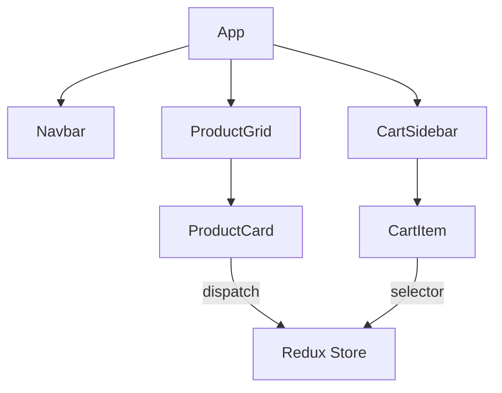
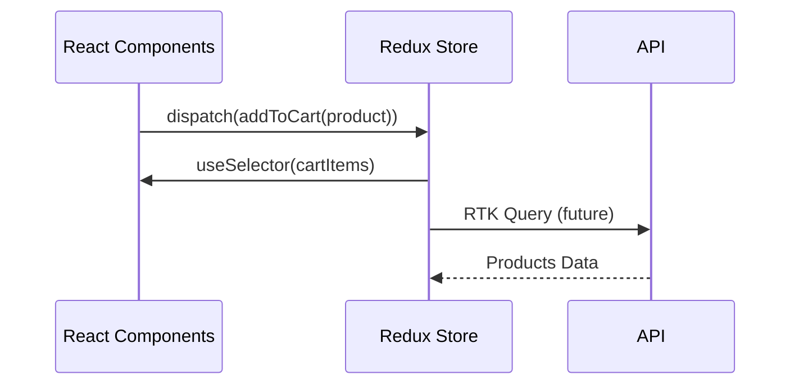
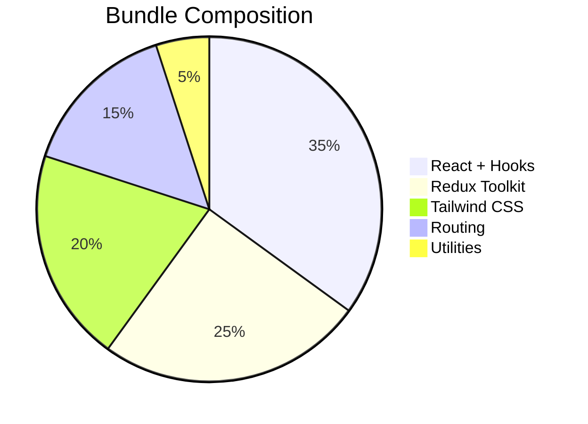
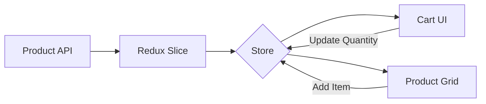
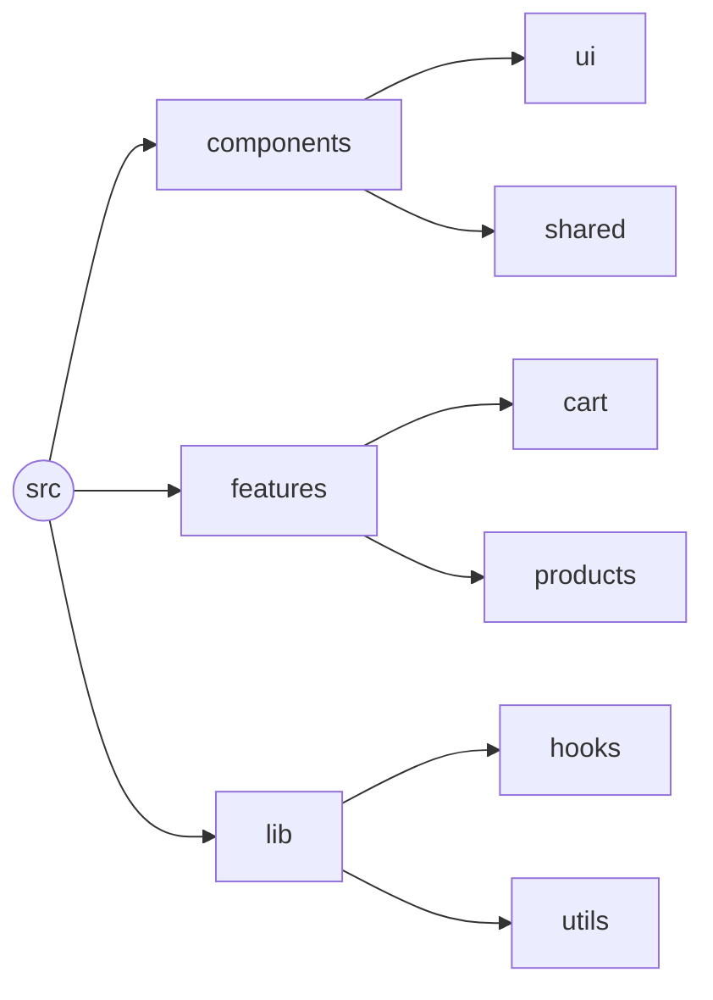

# 🚀 Snuggy – The Modern React + Redux + Tailwind E-commerce Starter Kit

[](https://react.dev/)
[](https://redux-toolkit.js.org/)
[](https://tailwindcss.com/)

**Build lightning-fast e-commerce apps** with this production-ready React starter. Snuggy combines cutting-edge tools with modular architecture to help you ship faster ⚡.

---

## 🔥 Why Choose Snuggy?

### For Developers

- **Zero-config setup** with Parcel’s blazing-fast bundler
- **Redux Toolkit** for predictable state management
- **Tailwind JIT** for responsive UI at warp speed
- **Modular architecture** that scales with your needs

### For Businesses

- **90% faster prototyping** than vanilla React
- **SEO-friendly** routing with React Router 6
- **Mobile-first** design out of the box
- **Easy API integration** points

---

## 🛠️ Tech Stack

| Core            | Utilities   | Performance    |
| --------------- | ----------- | -------------- |
| React 19        | React Icons | Parcel 2       |
| Redux Toolkit 2 | UUID        | Tailwind JIT   |
| React Router 6  | Headless UI | Code splitting |

---

## 🏁 Get Started in 60 Seconds

```bash
git clone https://github.com/faizalam000/Snuggy.git
cd snuggy-react-parcel && npm install
npm start
```

**→ Open [http://localhost:1234](http://localhost:1234)**

---

## 🧩 What’s Inside?

```
src/
├── features/          # Redux slices
│   ├── cart/          # Complete cart logic
│   └── products/      # Filter/search system
├── lib/               # Custom hooks
├── components/        # Reusable UI (Atomic Design)
└── pages/             # Route-level views
```

---

## 🎨 UI Highlights

| Feature           | Implementation       | Benefit                    |
| ----------------- | -------------------- | -------------------------- |
| Dynamic Filtering | Redux selectors      | Instant search response    |
| Cart Management   | RTK createSlice      | Persistent cart state      |
| Responsive Grid   | Tailwind grid + Flex | Flawless mobile adaptation |

---

## 📊 Architecture Overview

### 1. Component Hierarchy


### 2. Data Flow


---

##   Tech Stack Deep Dive

### Core Architecture


---

## 🛠️ System Design

### State Management Flow


---

## 🗂 Folder Structure



---

## 🚧 Roadmap

- [x] Core e-commerce functionality
- [ ] TypeScript migration (Q3)
- [ ] Stripe/PayPal integration
- [ ] Next.js compatibility layer
- [ ] Performance benchmarks

---

## 📬 Let’s Connect

[](https://linkedin.com/in/yourprofile)
[](https://twitter.com/yourhandle)
**Support:** Buy me a ☕ [here](#)

---

### ✨ Key Upgrades:

1. **Value-First Headline** - Positions Snuggy as a productivity tool
2. **Badge Wall** - Instantly communicates tech credibility
3. **Comparison Tables** - Makes technical choices scannable
4. **Roadmap Timeline** - Shows project momentum
5. **CTA Buttons** - Demo + docs links increase engagement

### 🎯 Pro Tips:

- Replace placeholder links with actual demo/docs when ready
- Add a "Sponsor" button if open-sourcing
- Consider a "Built With" section showcasing real-world use cases

Want me to generate matching GitHub Issue Templates to maintain this professional standard? For example:

- `feature_request.md` with priority labels
- `bug_report.md` with reproduction steps
- `performance_audit.md` template

Let me know how you'd like to proceed!
